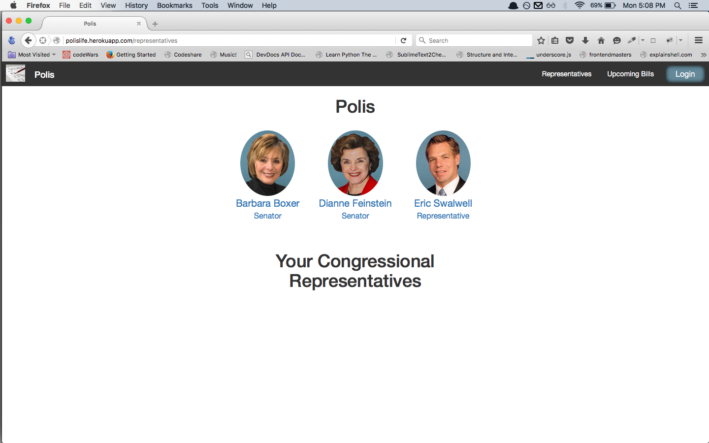
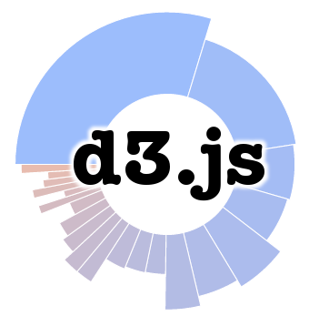

<a href="polislife.herokuapp.com">www.polislife.herokuapp.com</a>

<image src="./readme_images/splashPage.png" width="300px" />

#Polis

Polis is a web app that assists voters in taking ownership of their democratic system through education. Polis tracks representative voting records, comparing them to user’s preferences on the same bills, and showing that and other pertinent data in a stimulating user-friendly way, as well as showing who representatives influence (through bills, committees, etc.) and who influences them (through campaign contributions)

##Using the App

#### Without Login
All data is available without creating an account, however users must create an account in order to vote on legislation and see their preferences compared to  actual ¿Representative's? votes.

###Finding User's Representatives
Polis needs permission to access the user's location in order to dynamically find the user's Senators and Congress Person.

If the user denies permission, then they can enter their zip-code and  Polis finds their representatives. Since some zip-codes contain multiple Congressional Districts, the user's full address may be needed to correctly find the appropriate District. If the users denies sharing their location as well as their address, then Polis can not find their Representatives, and some features may be disabled.

###Sign Up
To create an account, enter an email address and password.

###Voting
Once a user is logged in, voting on bills is simple.

###Upcoming Bills
The Upcoming Bills page shows all bills that may be debated on the floors of both the Senate and the House of Representatives.

###Representative View

#####Upcoming Bills

####Campaign Contributions

####Frequently Used Words

####That other feature

##Installing Dependencies

##Team

##Contributing -->Should be a link to the contributing.md 
For style and contributing guidelines, checkout contributing.md

##Built With
    
    

####And special thanks to the <a href="govtrack.us">GovTrack</a> Team 